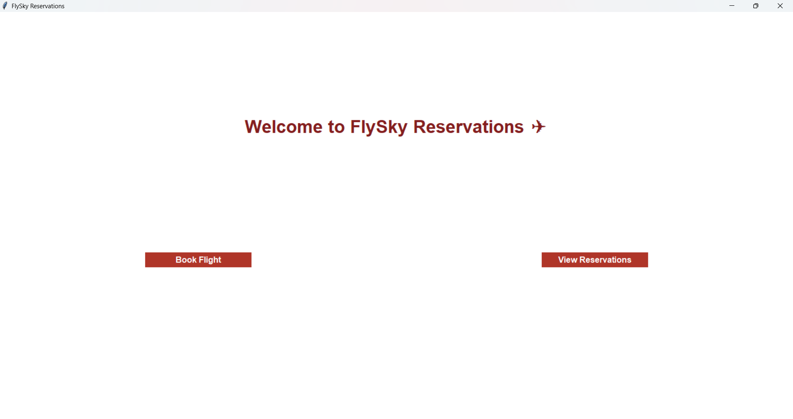
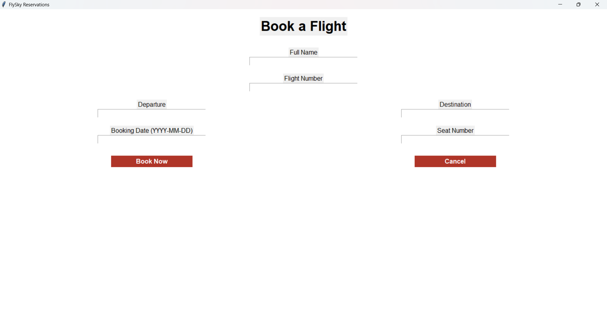
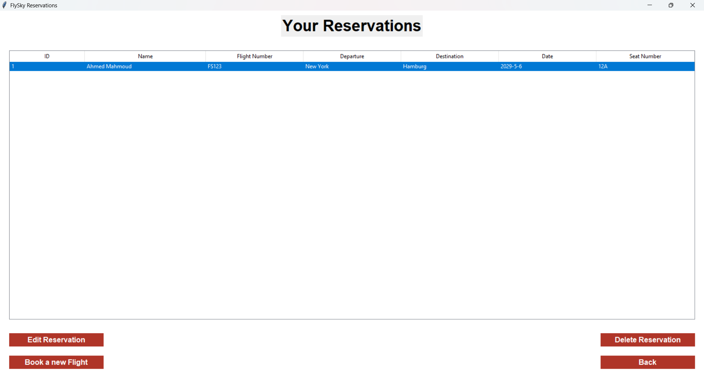

# ✈️ FlySky Reservations

A simple and elegant flight reservation system built with Python and Tkinter. FlySky allows users to book flights with an intuitive GUI interface and stores reservation data in a local SQLite database.

## 🌟 Features

- **Modern GUI Interface** - Clean and user-friendly design with custom styling
- **Flight Booking** - Complete booking system with passenger details
- **Data Validation** - Input validation to ensure data integrity  
- **SQLite Database** - Local database storage for reservations
- **Responsive Design** - Works on different screen sizes
- **Error Handling** - User-friendly error messages and confirmations

## 📋 Requirements

- Python 3.6+
- tkinter (usually comes with Python)
- sqlite3 (included in Python standard library)

No additional package installation required!

## 🚀 Installation

1. **Clone the repository:**
   ```bash
   git clone https://github.com/yourusername/flysky-reservations.git
   cd flysky-reservations
   ```

2. **Run the application:**
   ```bash
   python main.py
   ```

## 📁 Project Structure

```
flysky-reservations/
│
├── main.py          # Main application entry point
├── home.py          # Home screen module
├── booking.py       # Flight booking functionality
├── flights.db       # SQLite database (auto-created)
└── README.md        # Project documentation
```

## 🖥️ Usage

### Starting the Application
Run `python main.py` to launch FlySky Reservations.

### Booking a Flight
1. Click **"Book Flight"** from the home screen
2. Fill in all required information:
   - Full Name
   - Flight Number
   - Departure
   - Destination
   - Booking Date (YYYY-MM-DD format)
   - Seat Number
3. Click **"Book Now"** to save the reservation
4. Click **"Cancel"** to return to the home screen

### Data Storage
- All flight reservations are stored in a local SQLite database (`flights.db`)
- The database is automatically created on first run
- Data persists between application sessions

## 🎨 Screenshots

### Home Screen


### Booking Form


### View reservation form


## 🔧 Technical Details

### Architecture
- **Modular Design**: Separated into logical modules (main, home, booking)
- **Callback Pattern**: Prevents circular imports between modules
- **Database Management**: Automatic table creation and error handling

### Database Schema
```sql
CREATE TABLE flights (
    id INTEGER PRIMARY KEY AUTOINCREMENT,
    name TEXT NOT NULL,
    flight_number TEXT NOT NULL,
    departure TEXT NOT NULL,
    destination TEXT NOT NULL,
    date TEXT NOT NULL,
    seat_number TEXT NOT NULL
);
```

## 🛠️ Development

### Adding New Features
The modular structure makes it easy to extend:
- Add new screens by creating new modules
- Extend database schema as needed
- Implement additional validation rules

### Code Style
- Clean, readable code with proper comments
- Consistent naming conventions
- Error handling throughout the application

## Contributing

Contributions are welcome! Please feel free to submit a Pull Request. For major changes, please open an issue first to discuss what you would like to change.

### Development Setup
1. Fork the repository
2. Create your feature branch (`git checkout -b feature/AmazingFeature`)
3. Commit your changes (`git commit -m 'Add some AmazingFeature'`)
4. Push to the branch (`git push origin feature/AmazingFeature`)
5. Open a Pull Request

## 👨‍💻 Author

**Ahmed Mahmoud**
- Email: ahmedmahmo431@gmail.com

---

**FlySky Reservations** - Making flight booking simple and efficient! ✈️
